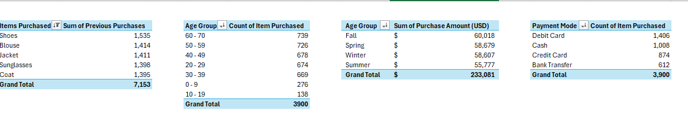
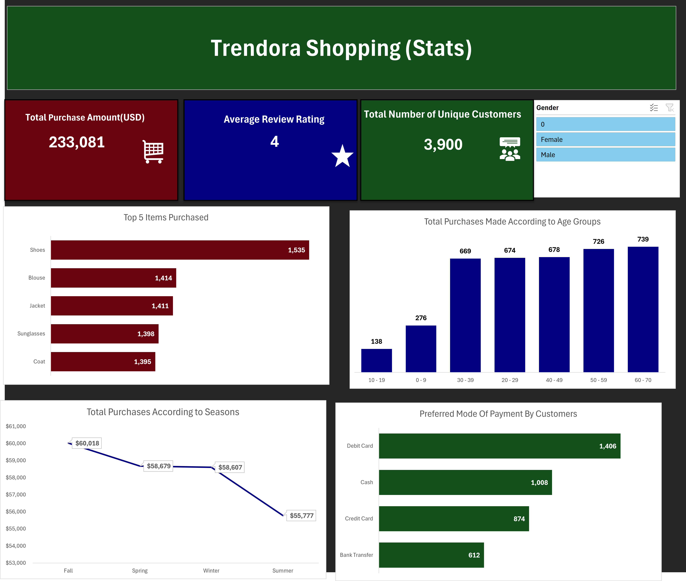

# Trendora Shopping Sales Analysis Report

## **Executive Summary**
Trendora is a rapidly expanding retail enterprise operating within a highly competitive consumer market. To sustain growth and safeguard profit margins, the business conducted a comprehensive, data-driven diagnostic of its transactional ecosystem. The underlying dataset tracks a diverse consumer base, spanning demographics from ages 0 to 70 across a wide variety of apparel and clothing categories.

## **Business Context**
Trendora is a rapidly expanding retail enterprise operating within a highly competitive consumer market. In modern retail, success is no longer just about selling products; it is about mastering data-driven agility. With fluctuating customer loyalties, shifting seasonal demands, and aggressive competitor pricing, Trendora must continuously optimize its operations to maintain its upward trajectory, scale efficiently, and safeguard its profit margins.

## **Objectives**
This report addresses the following key questions:
- What are the foundational KPIs—Total Revenue, Average Ratings, and Unique Customer Counts
- Which apparel categories and geographic markets are driving revenue growth, and which ones are underperforming?
- What are the preferred transactional channels and payment modes across our 0–70 demographic.

## **Data Overview**
The analysis is based on a consolidated dataset of approximately 3,900 transactions and 17 columns, covering varying categories of wears.

## **Data Preview**

## **Data Cleaning and Transformation**
To make sure the dashboard data are perfectly accurate, the data was cleaned by removing duplicate orders, standardizing text formatting, and deleting empty rows.

## **Detailed Findings & Analysis**
### **Key Performance Indicators**
- Total Revenue: $233,081 USD generated in total sales.
- Sales Volume: 3,900 total transactions processed.
- Customer Satisfaction: A strong average review rating of 4.0 out of 5.0.

## Trendora-Sales-Performance-Insights

### **Top 5 Items By Product Count**
- Shoes: Market leader in product velocity, securing first place with 1,535 total purchases.
- Blouse: Maintained a consistent second place with 1,414 total purchases.
- Lastly, Coat came in last among the top five items.

## **Monthly Sales Trend per Season** 
Fall emerges as Trendora's highest-grossing period, generating $60,018 USD in total revenue, driven largely by high-velocity transition-weather apparel. Spring follows closely in second place with $58,789 USD in sales. Winter and Summer round out the seasonal performance consecutively in third and fourth place, highlighting clear seasonal demand fluctuations that can help procurement teams optimize clothing inventory levels throughout the year.

## **Recommendations**
- Increase stocks of top items (Shoes, Blouses, Coats) before Fall and Spring, and clear inventory in Summer.
- Maintain the solid 4.0/5.0 rating across all 3,900 transactions by emailing customers a discount code for their next purchase in exchange for a product review.
- Optimize the website's top three payment methods to remove technical glitches, reducing cart abandonment and keeping transaction flows smooth.

## **Tools Used**
- **Excel**: Data cleaning, transformation, data analysis and visualization

## **Conclusion**
The final dashboard reveals that Trendora possesses a highly stable retail framework, anchored by a $233,081 USD total revenue pool across 3,900 transactions. By implementing the targeted inventory shifts, strategic product bundling, and checkout optimization recommended in this study, Trendora is well-positioned to eliminate seasonal stock inefficiencies, maximize lower-performing categories like Footwear, and convert its highly satisfied baseline audience into a predictable engine for recurring revenue.
